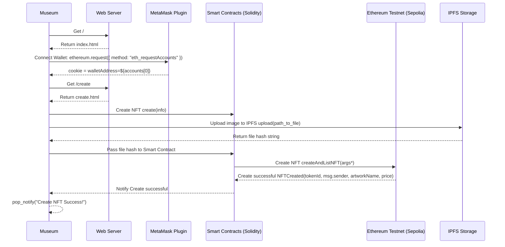
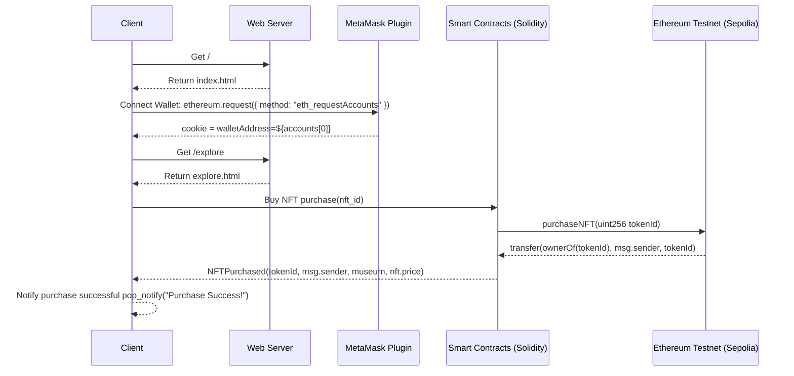
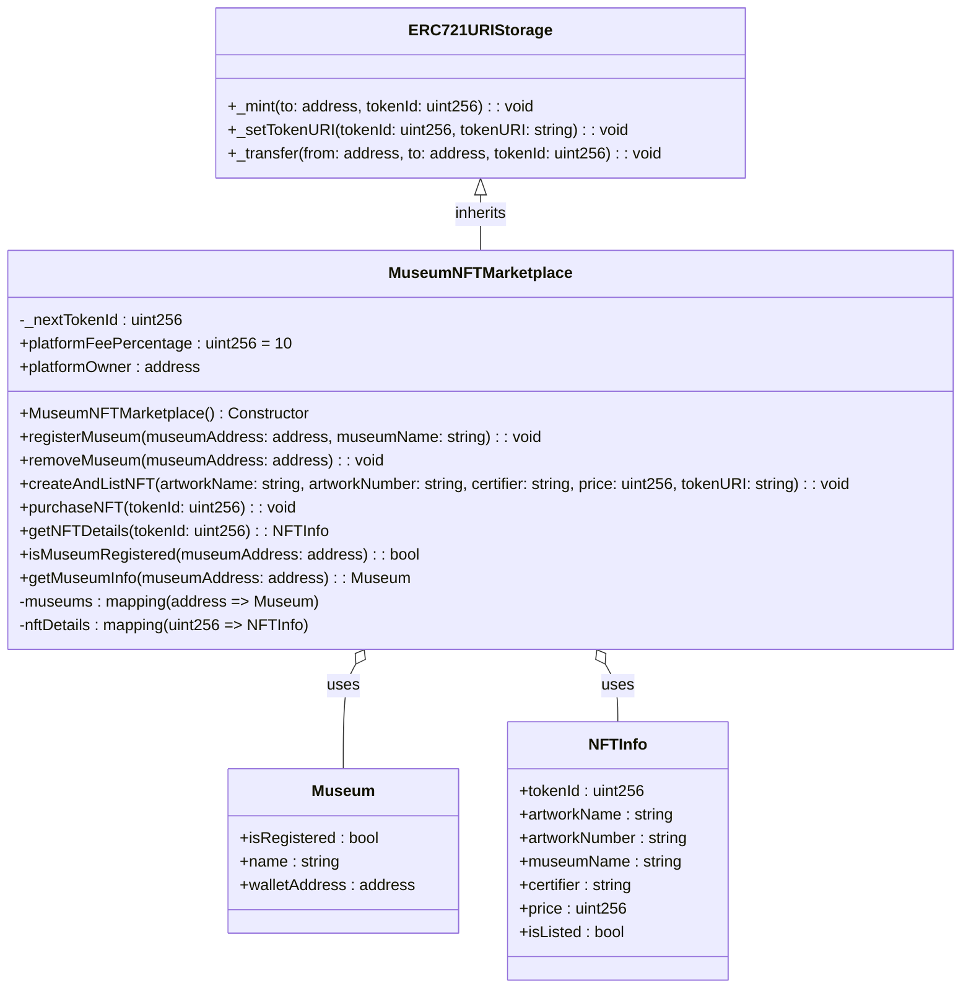

```mermaid
sequenceDiagram
    participant C as Museum
    participant W as Web Server
    participant M as MetaMask Plugin
    participant S as Smart Contracts (Solidity)
    participant E as Ethereum Testnet (Sepolia)
    participant I as IPFS Storage

    C->>W: Get /
    W-->>C: Return index.html
    C->>M: Connect Wallet: ethereum.request({ method: "eth_requestAccounts" });
    M-->>C: cookie = walletAddress=${accounts[0]};
    C->>W: Get /create
    W-->>C: Return create.html
    C->>S: Create NFT create(info);
    C->>I: Upload image to IPFS upload(path_to_file);
    I-->>C: Return file hash string;
    C->>S: Pass file hash to Smart Contract
    S->>E: Create NFT createAndListNFT(args*)
    E-->>S: Create successful NFTCreated(tokenId, msg.sender, artworkName, price);
    S-->>C: Notify Create successful
    C-->>C: pop_notify("Create NFT Success!");
```

```mermaid
sequenceDiagram
    participant C as Client
    participant W as Web Server
    participant M as MetaMask Plugin
    participant S as Smart Contracts (Solidity)
    participant E as Ethereum Testnet (Sepolia)

    C->>W: Get /
    W-->>C: Return index.html
    C->>M: Connect Wallet: ethereum.request({ method: "eth_requestAccounts" });
    M-->>C: cookie = walletAddress=${accounts[0]};
    C->>W: Get /explore
    W-->>C: Return explore.html
    C->>S: Buy NFT purchase(nft_id)
    S->>E: purchaseNFT(uint256 tokenId)
    E-->>S: transfer(ownerOf(tokenId), msg.sender, tokenId);
    S-->>C: NFTPurchased(tokenId, msg.sender, museum, nft.price);
    C-->>C: Notify purchase successful pop_notify("Purchase Success!");
```

```mermaid
classDiagram
    class MuseumNFTMarketplace {
        +MuseumNFTMarketplace() Constructor
        +registerMuseum(museumAddress: address, museumName: string) : void
        +removeMuseum(museumAddress: address) : void
        +createAndListNFT(artworkName: string, artworkNumber: string, certifier: string, price: uint256, tokenURI: string) : void
        +purchaseNFT(tokenId: uint256) : void
        +getNFTDetails(tokenId: uint256) : NFTInfo
        +isMuseumRegistered(museumAddress: address) : bool
        +getMuseumInfo(museumAddress: address) : Museum
        -museums : mapping(address => Museum)
        -nftDetails : mapping(uint256 => NFTInfo)
        -_nextTokenId : uint256
        +platformFeePercentage : uint256 = 10
        +platformOwner : address
    }

    class ERC721URIStorage {
        +_mint(to: address, tokenId: uint256) : void
        +_setTokenURI(tokenId: uint256, tokenURI: string) : void
        +_transfer(from: address, to: address, tokenId: uint256) : void
    }

    class Museum {
        +isRegistered : bool
        +name : string
        +walletAddress : address
    }

    class NFTInfo {
        +tokenId : uint256
        +artworkName : string
        +artworkNumber : string
        +museumName : string
        +certifier : string
        +price : uint256
        +isListed : bool
    }

    ERC721URIStorage <|-- MuseumNFTMarketplace : inherits
    MuseumNFTMarketplace o-- Museum : uses
    MuseumNFTMarketplace o-- NFTInfo : uses

```

